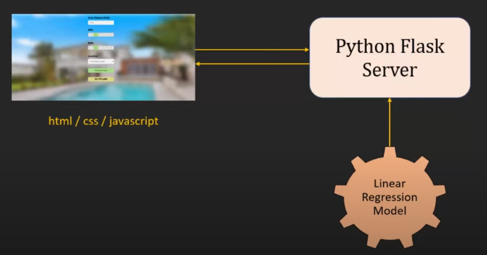

# Predicting Real Estate Prices in Bangalore (Machine Learning Project)
In this project I built a linear regression model to predict house prices in Bangalore, and created a web application from it. 
[__Click here__](http://ec2-54-209-136-199.compute-1.amazonaws.com/) to see the result!

This work is based on a very instructive end-to-end tutorial by [codebasics on YouTube](https://www.youtube.com/playlist?list=PLeo1K3hjS3uu7clOTtwsp94PcHbzqpAdg). Definitely check out their channel!

## Technologies used
* Jupyter Notebook
* Python (pandas, matplotlib, scikit-learn)
* HTML / CSS / JavaScript
* Flask
* AWS EC2 / NGINX

_Schematic representation of the project (Image is a screenshot from [@codebasic tutorial](https://www.youtube.com/watch?v=rdfbcdP75KI&list=PLeo1K3hjS3uu7clOTtwsp94PcHbzqpAdg&index=1))_

## Process Overview
### Model
The data used is the [Bengaluru House price dataset from kaggle](https://www.kaggle.com/datasets/amitabhajoy/bengaluru-house-price-data). 
Columns: area_type, availability, location, size (number of bedrooms), society, total_sqft, bath (count), balcony (count), price.

#### Data Cleaning
* Dropping columns not interesting for model (area_type, society, balcony, availability)
* Handling NA values (dropping rows with NA, since they are not many)
* Making values in size-column uniform (only keep number from string, convert to int), rename to bhk
* Check for outliers (check unique values in bhk, remove houses with more than 20 bedrooms)
* Clean total_sqft column (sometimes there are ranges of values, calculate mean for these)

#### Feature Engineering and Outlier/Error Removal
* New feature 'price_per_sqft': price/total_sqft
* Problem with 'location': categorical, too many (>1000) options. Usually for text data, creation of dummy columns with one-hot encoding. In this case, this would mean >1000 new columns (too many).
* Solution: __Dimensionality reduction__ - Remove locations that appear <=10 times, summarize them under "other" (leaves us with <300 new columns)
* Remove rows with less than threshold value (300sqft) for sqft per bedroom
* Remove rows where price_per_squarefoot is too low or high (anything above or below one standard deviation)
* Remove rows where 2-bedroom apartments are more expensive than 3-bedroom apartment for same size and area (Note: I am wondering if it really makes sense to remove these as outliers. Big rooms can be preferable and more expensive, e.g. for people without children)
* Remove rows where number of bathrooms > number of rooms
* drop price_per_sqft column used for outlier detection, and size (because it is represented in bhk), to only keep columns used in model
* Continue feature-engineering by using __one-hot encoding__ for location-column (pd.get_dummies for location) --> because our model cannot read text data.
* To avoid dummy-variable trap, we should have one column less than values. One column can be dropped (if all other columns are 0, it means the dropped column is the respective value). Drop 'other'.

#### Model Building
* Create df with independent variables (X for our model) by dropping price (Y) column from our df.
* Create Y (price column from df)
* Divide dataset in train and test datasets (with sklearn.model_selection), test size 20%.
* Create __linear regression model__ with __sklearn__.linear_model. Train model with training dataset and LinearRegression.fit() method, test it with test dataset and LinearRegression.score(). 
* Score is 0.845
* __K-fold cross-validation__ with sklearn.model_selection: With Shufflesplit, create 5 times randomized train and test datasets from data, then use cross_val_score to run model on all of them.
* Scores are between 0.77 and 0.85
* Trying other regression techniques to see if there is another model that fits better: Using __GridSearchCV__ from sklearn, trying __Lasso__ and __DecisionTreeRegressor__ including __hyperparameter tuning__ via parameters passed to GridSearchCV.
* Linear regression model has highest scores --> we will keep it.
* Writing predict_price function (parameters: location, sqft, bath, bhk) that feeds the respective fiels into the model we trained before (using _modelname_.predict([x]))
* Exporting artifacts needed by our server: Export model to __pickle__ file (scores model parameters). Export columns to json file. 

### Web App
#### Backend: Python Flask Server
* Create client, model, and server directories locally. 
* Paste artifacts(pickle file, json file) and notebook to model folder.
* In server directory, create server.py and import __Flask__, create simple application with hello routine to test if it works. Run with python __server.py__, and call localhost with route in server.
* Create subdirectory and paste pickle and json artifacts. 
* Create __util.py__ for functions, so that server.py will only do routing of requests and responses.
* In util.py write routine that returns locations from json file to display them in a dropdown in the UI later, and loads the pickle model. Write function that returns model predictions for model parameters.
* In server.py create function get_location_names (route /get_location_name) and post function predict_home_price (route /predict_home_price). For predict_home_price, use request module to get user form inputs from UI as model parameters, then run util.get_estimated_price function with these parameters.
* __Test http calls__ with __Postman__ app. Run app and paste localhost + route to Postman. Test if get_location_names and predict_home_price work (for latter one, add example parameter values to postman form).

#### Frontend 
* In client directory, create app.html, app.css, and app.js files.
* Create simple html structure, and css styling.
* JS: To get location names from backend, specify onPageLoad function --> make http call to /get_location_names. Add locations one by one as options to dropdown.
* JS: Implement function for clicking on "Estimate price" button. Function OnClickedEstimatePrice(). Write helper functions getBathValue and getBHKValue, which read number from radiobuttions clicked in UI, and parse them to int. Call these in price estimate function, as well as selected value from location dropdown, and estimated price display. Make post function to /predict_home_price route. Change innerHTML of of price display to new estimated price.
* Test on localhost.

#### Deployment
* Using __Nginx__ web server to server frontend on port 80. Routing api requests to Python Flask server on port 5000 to serve ML model.
* Setting up nginx locally. Adapt conf file to show our html page. Adapt app.js to route to api instead of localhost. Adapt conf to route /api/ to localhost port 5000. 
* Test: run python server.py, and test UI and function call on nginx.
* Create amazon __EC2__ instance (Ubuntu). Download key pair and put in local ssh folder, launch instance.
* Connect to server using ssh and key files. Move files to ubuntu/home with scp.
* Install nginx on server. Adapt conf file to show our app.html. On server, one cannot directly adapt it, but has to add the info to sites_available folder. Create bhp.conf file with server info, create simlink. 
* Run nginx to test. Run url to ec2 instance. Shows UI, but backend not working yet.
* Install requirements.txt with pip. Run server.py. Refresh page. Code works. (Note this did not work as smoothly as in the tutorial. I had to install an older python version and adapt module versions in order to resolve conflicts.)
* To keep script website running, create and run tmux window.
